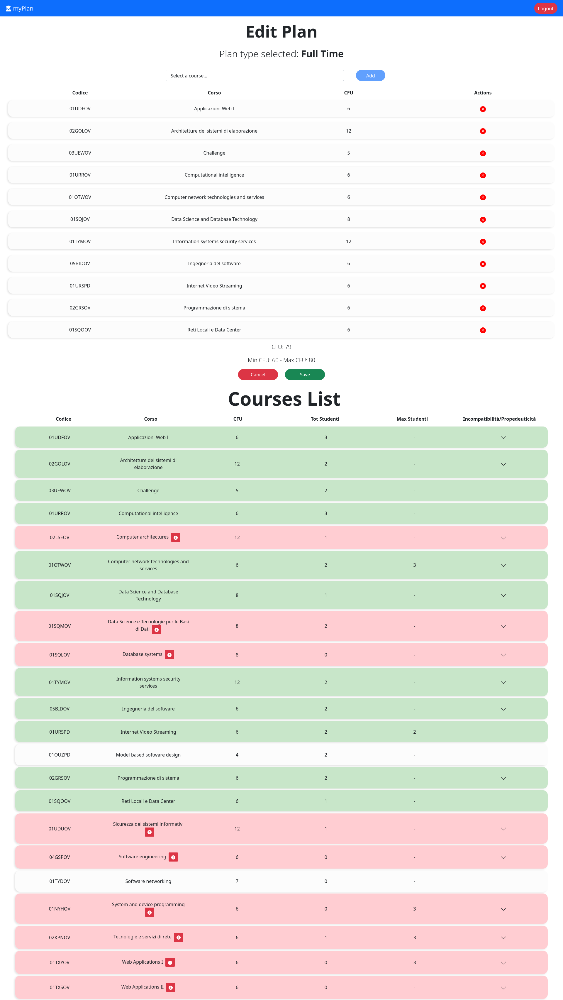
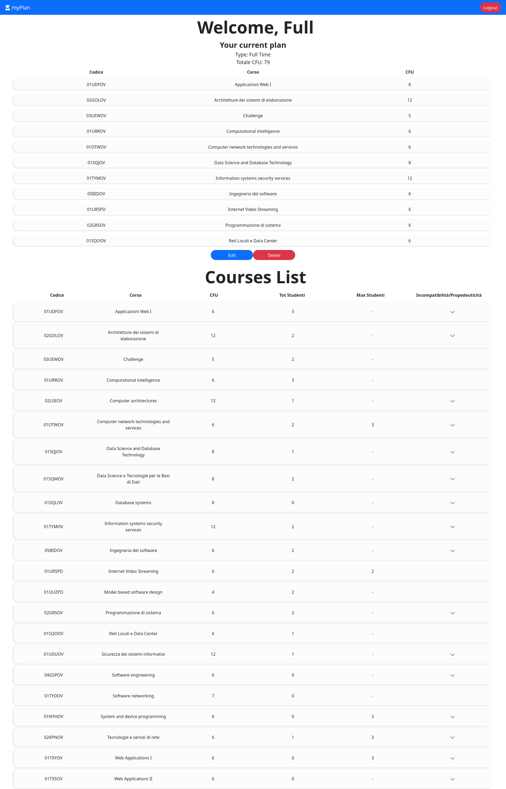

# Web Application Exam #1: "Piano di studi"
## Student: CRISCI LUIGI 

## __React Client Application Routes__

- Route `/`: nel caso in cui l'utente non è autenticato sarà possibile visualizzare la sola lista dei corsi forniti. Nel caso in cui l'utente sia autenticato, i corsi continueranno ad essere visualizzati ma verrà renderizzato anche, se presente, il piano di studi inserito dall'utente nella sessione precedente. 

- Route `/editPlan`: route annidata che permetterà di visualizzare la schermata di modifica del piano di studi, sia di creazione o di modifica nel caso in cui l'utente ha già inserito il piano di studi.

- Route `/login`: è presente il form di login in modo tale che l'utente possa autenticarsi ed accedere all'applicazione.
 
- Route `*`: pagina non trovata.

## __API Server__

### __Courses API__
- GET `/api/courses`
  - Description: richiede la lista di tutti i corsi.
  - Body request: `none`
  - Response status: `200 success`, `503 Internal Server Error` (generic server error). 
  - Response body: 

        [
          {
            "codice": "01UDFOV",
            "titolo": "Applicazioni Web I",
            "crediti": 6,
            "incompatibilita": "01TXYOV",
            "propedeuticita":null
          },
          {
            "codice": "02GOLOV",
            "titolo": "Architetture dei sistemi di elaborazione",
            "crediti": 12,
            "incompatibilita": "02LSEOV",
            "propedeuticita": null
          }
          ...
        ]

### __Plans API__

- GET `/api/plans`
  - Description: se disponibile ritorna il piano di studi associato all'utente.
  - Request body: `none`
  - Response status: `200 success`, `401 Unauthorized` (not authenticated), `503 Internal Server Error` (generic server error).
  - Response body:

        [
          {
            "codice": "01UDFOV",
            "titolo": "Applicazioni Web I",
            "crediti": 6,
            "incompatibilita": "01TXYOV",
            "propedeuticita": null
          },
          {
            "codice": "02GOLOV",
            "titolo": "Architetture dei sistemi di elaborazione",
            "crediti": 12,
            "incompatibilita": "02LSEOV",
            "propedeuticita": null
          },
          ...
        ]

- POST `/api/plans`
  - Description: permette di inserire un nuovo piano di studi.
  - Request body:

        {
          "available": 1,
          "plan": [
                    {
                      "codice": "01UDFOV",
                      "titolo": "Applicazioni Web I",
                      "crediti": 6,
                      "incompatibilita": "01TXYOV",
                      "propedeuticita": null
                    },
                    {
                      "codice": "01URROV",
                      "titolo": "Computational intelligence",
                      "crediti": 6,
                      "incompatibilita": null,
                      "propedeuticita": null
                    },
                    ...
                  ]
        }

  - Response status: `200 Success`, `422 Unprocessable Entity` (invalid format), `503 Internal Server Error`  (generic server error).
  - Response body: 

        {
             "type": 1,
             "plan": [
                       {
                         "codice": "01UDFOV",
                         "titolo": "Applicazioni Web I",
                         "crediti": 6,
                         "incompatibilita": "01TXYOV",
                         "propedeuticita": null
                       },
                       {
                         "codice": "01URROV",
                         "titolo": "Computational intelligence",
                         "crediti": 6,
                         "incompatibilita": null,
                         "propedeuticita": null
                       },
                       ...
                     ]
        }

- PUT `/api/plans`
  - Description: permette di modificare un piano di studi esistente.
  - Request body: 

        {
          "available": 1,
          "plan": [
                    {
                        "codice": "03UEWOV",
                        "titolo": "Challenge",
                        "crediti": 5,
                        "incompatibilita": null,
                        "propedeuticita": null
                    },
                    {
                        "codice": "05BIDOV",
                        "titolo": "Ingegneria del software",
                        "crediti": 6,
                        "incompatibilita": "04GSPOV",
                        "propedeuticita": "02GOLOV"
                    },
                    ...
                  ]
        }
  - Response status: `200 Success`, `401 Unauthorized` (not authenticated), `503 Internal Server Error`.
  - Response body:

        {
              "available": 1,
              "plan": [
                        {
                            "codice": "03UEWOV",
                            "titolo": "Challenge",
                            "crediti": 5,
                            "incompatibilita": null,
                            "propedeuticita": null
                        },
                        {
                            "codice": "05BIDOV",
                            "titolo": "Ingegneria del software",
                            "crediti": 6,
                            "incompatibilita": "04GSPOV",
                            "propedeuticita": "02GOLOV"
                        },
                        ...
                      ]
        }

- DELETE `/api/plans`
  - Description: consente di eliminare il piano di studi.
  - Request body: `none`
  - Response status: `200 Success`, `401 Unauthorized` (not authenticated), `503 Internal Server Error`.
  - Response body:

        {
          "message": "Delete success"
        }

### __User API__

- GET `/api/sessions/current`
  - Description: restituisce le informazioni dell'utente se è loggato all'interno del sistema.
  - Request body: `none`
  - Response status: `200 success`, `401 Unauthorized`.
  - Response body: 

        {
          "id": 3,
          "username": "full@polito.it",
          "nome": "Full",
          "cognome": "Time",
          "available": 1
        }

- POST `/api/sessinos`
  - Description: login con email e password
  - Request body: 

        {
          "username": "full@polito.it",
          "password": "password"
        }

  - Response status: `200 Success`, `422 Email not valid`, `401 Unauthorized` (incorrect username or password).
  - Response body:

        {
          "id": 3,
          "username": "full@polito.it",
          "nome": "Full",
          "cognome": "Time",
          "available": 1
        }

- DELETE `/api/sessions/current`
  - Description: utente effettua il logout.
  - Request body: `none`
  - Response status: `200 success`
  - Response body: `none`

## __Database Tables__

- Table `users` - contiene utenti registrati nel sistema, columns: id email hash nome cognome salt available ;
- Table `plans` - contiene le associazioni corso - utente per risalire a piano di studi dell'utente, columns: userId courseId ;
- Table `courses` - contiene i corsi disponibili, columns: codice titolo crediti tot_studenti max_studenti  incompatibilita propedeuticita ;

## __Main React Components__

- `LandingPage` (in `components/LandingPage/LandingPage.js`): componente che contiene sempre la lista dei corsi, nel momento in cui l'utente effettua il login renderizzerà anche le informazioni relative all'utente.

- `UserView` (in `components/LandingPage/UserView.js`): componente che mostra le informazioni dell'utente, verrà renderizzato solo se l'utente è autenticato. Nel caso in cui l'utente disponde di un piano di studi lo mostrerà immediatamente altrimenti verrà mostrato un messaggio che indica la sua assenza.

- `StudyPlanAvailable` (in `components/LandingPage/UserView.js`): componente che viene renderizzato se all'atto dell'autenticazione, l'utente che ha effettuato il login ha già precedentemente inserito un piano di studi, verranno quindi mostrate le informazioni riguardo al tipo e i corsi presenti all'interno del piano di studi.

- `StudyPlanNotAvailable` (in `components/LandingPage/UserView.js`): componente che viene renderizzato se all'atto dell'autenticazione, l'utente che ha effettuato il login non ha già inserito un piano di studi. Sarà quindi possibile crearlo e salvarlo in modo persistente.

- `CourseList` (in `components/LandingPage/CourseList/CourseList.js`): componente che mostra la lista dei corsi, e le relative informazioni. Nel caso in cui l'utente inserisce o modifica il piano di studi la lista mostrerà (attraverso il cambio di colore dell'intera riga) se il corso può essere aggiunto o meno, in caso negativo di fianco al nome sarà possibile visualizzare la motivazione del perchè non può essere aggiunto.

- `PlanForm` (in `components/LandingPage/PlanForm.js`): componente che si occupa di fornire la view di editing con cui l'utente si interfaccia per creare da zero un nuovo piano di studi oppure, se già presente, permette di modificare il piano di studi aggiungengo o eliminando corsi al piano. 

## __Screenshot Editing Page__

## __Screenshot LoggedIn Page__

## __Users Credentials__

| email | password |
|-------|----------|
| full@polito.it | password |
| part@polito.it | password |
| aw1@polito.it | password |
| gennaro.esposito@polito.it | password |
| pippo.pluto@polito.it | password |

## __Users Informations__

- full@polito.it: Full time plan.
- part@polito.it: Part time plan.
- aw1@polito.it: Full time plan.
- gennaro.esposito@polito.it: Study plan not available.
- pippo.pluto@polito.it: Part time plan.
